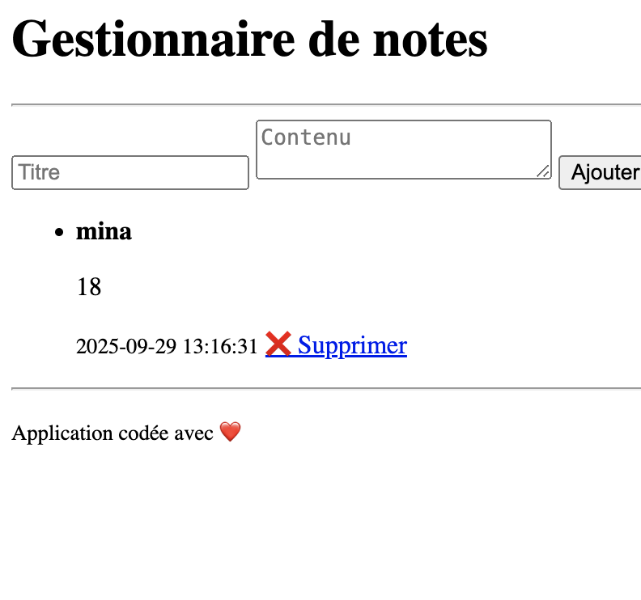

# Gestionnaire de notes (PHP + SQLite)

Mini-application web en **PHP procédural avec PDO** pour gérer des notes.

Chaque note contient :
- un **titre**
- un **contenu**
- une **date de création**

## ✨ Fonctionnalités
- Ajouter une note
- Afficher toutes les notes (titre, contenu, date)
- Supprimer une note
- Séparation simple du code (models / views / controllers)
- Sécurité de base :
  - Requêtes préparées PDO
  - `htmlspecialchars` à l’affichage

## 📂 Arborescence
```gestion-notes/
│── README.md
│── database.sql
│── database.sqlite
│
├── controllers/
│ └── noteController.php
│
├── models/
│ ├── db.php
│ └── noteModel.php
│
├── views/
│ ├── header.php
│ ├── footer.php
│ ├── notes.php
│ └── form.php
│
├── notes-app/
│ └── index.php ← page principale (inclut controller + vues)
│
└── screenshots/
└── app-home.png ← capture d’écran de l’app```


## 📸 Capture d’écran


## 🛠️ Prérequis
- PHP 8+
- SQLite3 (installé par défaut sur macOS/Linux)

## 🚀 Installation & Lancement (consigne prof)
1. Créer la base (si besoin) :
   ```bash
   sqlite3 database.sqlite < database.sql```


##🧱 Notes techniques (très basiques)

Connexion SQLite : models/db.php

Fonctions CRUD : models/noteModel.php

Logique (POST ajout, GET suppression, liste) : controllers/noteController.php

Pages visibles : views/ (HTML + un peu de PHP)

Page d’entrée : notes-app/index.php

##👤 Auteur

Mina Boussamgane — La Plateforme_
